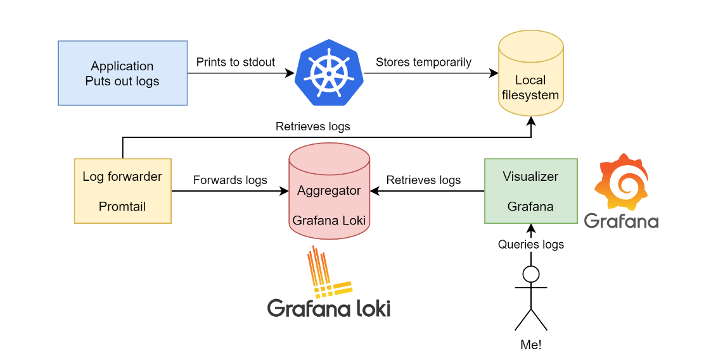
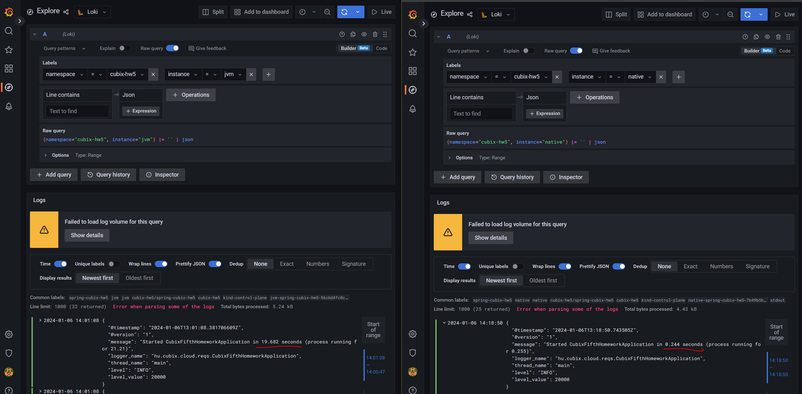
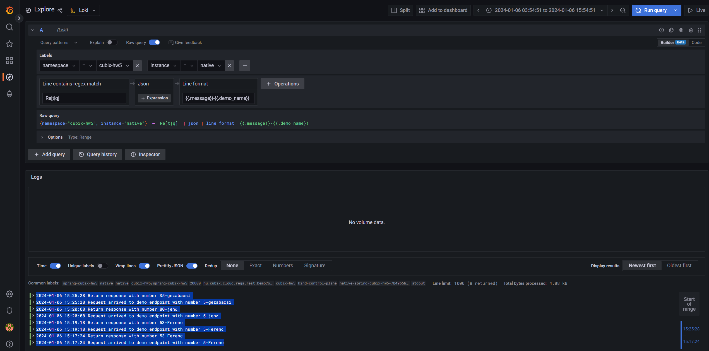

## Log beállítás kiválasztása

A Kubernetes a stdout/stderror stream-eket tárolja lokális fájlrendszeren ideiglenesen.
A jelenlegi setup a következő:


Igény a struktúrált logolás (pl. json) is, ezért a lehetséges opciók közül a 
- 	stdout-json - prints out logs in JSON format to the standard out

a jó választás.

A két values.yaml file-ba ez a sor kerül.

```yaml
loggingMode: stdout-json
```

## Választás a két alkalmazás közül

A két alkalmazás sacc/kb ugyan azt logolja, az egyetlen különbség a startup time.


- jvm 19.682s
- native 0.244s


jvm:

```json	
{
  "@timestamp": "2024-01-06T13:01:08.381706609Z",
  "@version": "1",
  "message": "Started CubixFifthHomeworkApplication in 19.682 seconds (process running for 21.21)",
  "logger_name": "hu.cubix.cloud.reqs.CubixFifthHomeworkApplication",
  "thread_name": "main",
  "level": "INFO",
  "level_value": 20000
}
```
native:
```json
{
  "@timestamp": "2024-01-06T13:18:50.743505Z",
  "@version": "1",
  "message": "Started CubixFifthHomeworkApplication in 0.244 seconds (process running for 0.255)",
  "logger_name": "hu.cubix.cloud.reqs.CubixFifthHomeworkApplication",
  "thread_name": "main",
  "level": "INFO",
  "level_value": 20000
}
```

Egy cloude native alkalmazásnál előny, ha minnél gyorsabban újta tud indulni ezért a továbbiakban a 

- native

változattal fogok dolgozni.


## Log szürés és formázás feladat:


```
{namespace="cubix-hw5", instance="native"} |~ `Re[t|q]` | json | line_format `{{.message}}-{{.demo_name}}`
```
Regexp alapú szüréssel 
```
~ `Re[t|q]`
```
csak a szükséges sorokat (Request és Return) engedem át:

```
2024-01-06 15:25:28	
Return response with number 35-gezabacsi
2024-01-06 15:25:28	
Request arrived to demo endpoint with number 5-gezabacsi
2024-01-06 15:20:08	
Return response with number 80-jenő
2024-01-06 15:20:08	
Request arrived to demo endpoint with number 5-jenő
2024-01-06 15:19:18	
Return response with number 53-Ferenc
2024-01-06 15:19:18	
Request arrived to demo endpoint with number 5-Ferenc
2024-01-06 15:17:24	
Return response with number 53-Ferenc
2024-01-06 15:17:24	
Request arrived to demo endpoint with number 5-Ferenc
```


## Health check feladat

A deployment.yaml megfelelő részlete:

```yaml
          startupProbe:
            periodSeconds: 1
            failureThreshold: 30
            httpGet:
              port: management
              path: /actuator/health/liveness
          livenessProbe:
            periodSeconds: 10
            failureThreshold: 2
            httpGet:
              port: management
              path: /actuator/health/liveness
          readinessProbe:
            periodSeconds: 5
            failureThreshold: 1
            httpGet:
              port: management
              path: /actuator/health/readiness
```

```
kubectl describe deployment.apps/native-spring-cubix-hw5 -n cubix-hw5

Name:                   native-spring-cubix-hw5
Namespace:              cubix-hw5
CreationTimestamp:      Sat, 06 Jan 2024 14:18:38 +0100
Labels:                 app.kubernetes.io/instance=native
                        app.kubernetes.io/managed-by=Helm
                        app.kubernetes.io/name=spring-cubix-hw5
                        app.kubernetes.io/version=1.0.0-SNAPSHOT
                        helm.sh/chart=spring-cubix-hw5-1.0.0
Annotations:            deployment.kubernetes.io/revision: 2
                        meta.helm.sh/release-name: native
                        meta.helm.sh/release-namespace: cubix-hw5
Selector:               app.kubernetes.io/instance=native,app.kubernetes.io/name=spring-cubix-hw5
Replicas:               1 desired | 1 updated | 1 total | 1 available | 0 unavailable
StrategyType:           RollingUpdate
MinReadySeconds:        0
RollingUpdateStrategy:  25% max unavailable, 25% max surge
Pod Template:
  Labels:           app.kubernetes.io/instance=native
                    app.kubernetes.io/name=spring-cubix-hw5
  Service Account:  native-spring-cubix-hw5
  Containers:
   native:
    Image:       quay.io/drsylent/cubix/block5/homework:springboot3native
    Ports:       8080/TCP, 8081/TCP
    Host Ports:  0/TCP, 0/TCP
    Limits:
      cpu:     1
      memory:  100Mi
    Requests:
      cpu:      100m
      memory:   100Mi
    Liveness:   http-get http://:management/actuator/health/liveness delay=0s timeout=1s period=10s #success=1 #failure=2
    Readiness:  http-get http://:management/actuator/health/readiness delay=0s timeout=1s period=5s #success=1 #failure=1
    Startup:    http-get http://:management/actuator/health/liveness delay=0s timeout=1s period=1s #success=1 #failure=30
    Environment:
      JAVA_OPTS:
      SERVER_TOMCAT_THREADS_MAX:  50
      SPRING_PROFILES_ACTIVE:     stdout-json
      SERVER_PORT:                8080
      MANAGEMENT_SERVER_PORT:     8081
    Mounts:                       <none>
  Volumes:                        <none>
Conditions:
  Type           Status  Reason
  ----           ------  ------
  Available      True    MinimumReplicasAvailable
  Progressing    True    NewReplicaSetAvailable
OldReplicaSets:  native-spring-cubix-hw5-7b49b5b556 (0/0 replicas created)
NewReplicaSet:   native-spring-cubix-hw5-789f76f486 (1/1 replicas created)
Events:
  Type    Reason             Age   From                   Message
  ----    ------             ----  ----                   -------
  Normal  ScalingReplicaSet  56s   deployment-controller  Scaled up replica set native-spring-cubix-hw5-789f76f486 to 1
  Normal  ScalingReplicaSet  53s   deployment-controller  Scaled down replica set native-spring-cubix-hw5-7b49b5b556 to 0 from 1
```
```
kubectl get all -n cubix-hw5
NAME                                           READY   STATUS    RESTARTS   AGE
pod/native-spring-cubix-hw5-789f76f486-c4dwk   1/1     Running   0          5m33s

NAME                              TYPE        CLUSTER-IP      EXTERNAL-IP   PORT(S)    AGE
service/native-spring-cubix-hw5   ClusterIP   10.96.234.211   <none>        8080/TCP   117m

NAME                                      READY   UP-TO-DATE   AVAILABLE   AGE
deployment.apps/native-spring-cubix-hw5   1/1     1            1           117m

NAME                                                 DESIRED   CURRENT   READY   AGE
replicaset.apps/native-spring-cubix-hw5-789f76f486   1         1         1       5m33s
replicaset.apps/native-spring-cubix-hw5-7b49b5b556   0         0         0       117m
```
